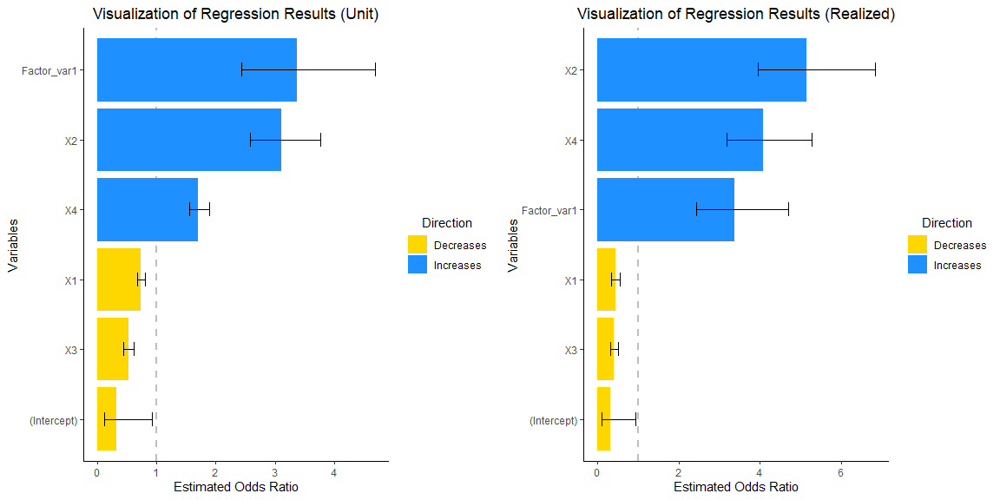
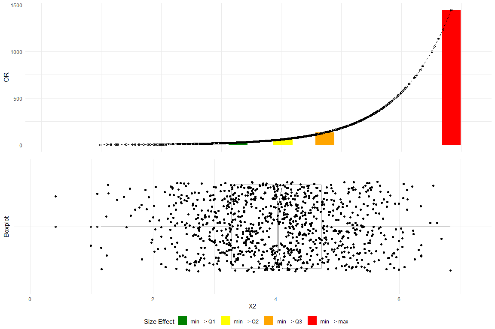
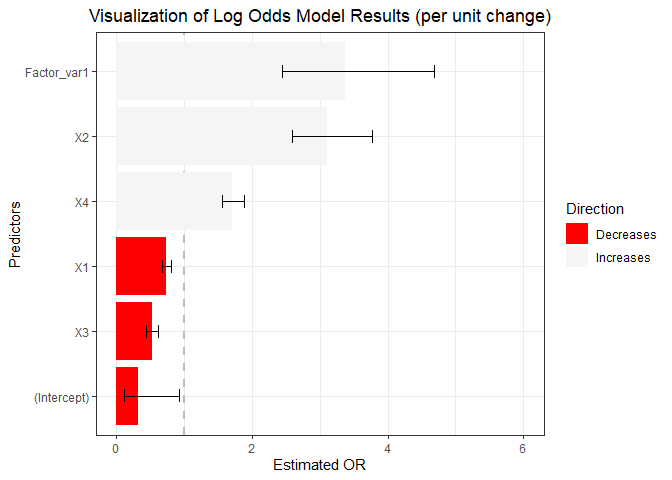
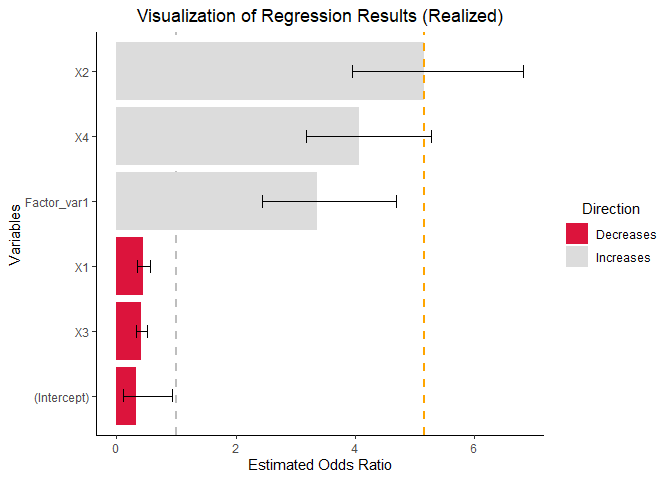

<!-- README.md is generated from README.Rmd. Please edit that file -->

# RegrCoeffsExplorer

<!-- badges: start -->


[](https://github.com/r-lib/rcmdcheck/actions/workflows/R-CMD-check.yaml)
<!-- badges: end -->

*Always present effect sizes for primary outcomes* (Wilkinson 1999).

*The size of the regression weight depends on the other predictor
variables included in the equation and is, therefore, prone to change
across situations involving different combinations of predictors*
(Dunlap and Landis 1998).

*Any interpretations of weights must be considered context-specific*
(Thompson 1999).

*Dissemination of complex information derived from sophisticated
statistical models requires diligence* (Chen 2003).

The **goal** of `RegrCoeffsExplorer` is to **enhance the
interpretation** of regression results by providing **visualizations**
that integrate empirical data distributions. This approach facilitates a
more thorough understanding of the impacts of changes exceeding one unit
in the independent variables on the dependent variable for models fitted
within Linear Models (LM), Generalized Linear Models (GLM), and
Elastic-Net Regularized Generalized Linear Models (GLMNET) frameworks.

## Installation

You can install the current version of `RegrCoeffsExplorer` from
[GitHub](https://github.com/vadimtyuryaev/RegrCoeffsExplorer) with:

``` r
library(devtools)

devtools::install_github("vadimtyuryaev/RegrCoeffsExplorer",    
                         ref = "main",
                         dependencies = TRUE,
                         build_vignettes = TRUE)
```

Alternatively, you can use the `remotes` library with the following
command: `remotes::install_github()`.

## A Very Brief Recap on Logistic Regression

Logistic regression (McCullagh and Nelder 1989) is a statistical method
used for binary classification. Unlike linear regression, which predicts
continuous outcomes, logistic regression predicts the probability of a
binary outcome (1 or 0, Yes or No, True or False). The core function in
logistic regression is the logistic function, also known as the
**sigmoid function**, which maps any input into the range (0, 1), making
it interpretable as a **probability**. In logistic regression, we model
the **log odds** (logarithm of Odds Ratio) of the probability as a
linear function of the input features.

Sigmoid function is defined as:

$$\sigma(z)=\frac{1}{1+\exp(-z)}$$

Probability of **success** is calculated in the following manner:

$$P(Y=1|\mathbf{X}) = \pi(\mathbf{X}) = \frac{\exp(\beta_{0}+\beta_{1}X_{1}+\ldots+\beta_{n}X_{n})}{1+\exp(\beta_{0}+\beta_{1}X_{1}+\ldots+\beta_{n}X_{n})} =\frac{\exp(\mathbf{X}\beta)}{1+\exp(\mathbf{X}\beta)} = \frac{1}{1+\exp(-\mathbf{X}\beta)}$$

Odds Ratio is:

$$OR = \frac{\pi(\mathbf{X})}{1-\pi(\mathbf{X})} =\frac{\frac{\exp(\mathbf{X}\beta)}{1+\exp(\mathbf{X}\beta)}}{1- \frac{\exp(\mathbf{X}\beta)}{1+\exp(\mathbf{X}\beta)}} =\exp(\beta_{0}+\beta_{1}X_{1}+\ldots+\beta_{n}X_{n})$$

Log Odds or the Logistic Transformation of the probability of success
is:

$$\log{OR}=\log{\frac{\pi(\mathbf{X})}{1-\pi(\mathbf{X})}} =\beta_{0}+\beta_{1}X_{1}+\ldots+\beta_{n}X_{n}$$

Change in log odds when one predictor variable ($X_{1}$) increases by
one unit, while **all other variables remain unchanged**:

$$\log{\frac{P(Y=1|\mathbf{X_{X_1=X_1+1}})}{P(Y=0|\mathbf{X_{X_1=X_1+1}})}} -\log{\frac{P(Y=1|\mathbf{X_{X_1=X_1}})}{P(Y=0|\mathbf{X_{X_1=X_1}})}} \overset{1}{=}$$

$$\overset{1}{=} \beta_{0}+\beta_{1}(X_{1}+1)+\ldots+\beta_{n}X_{n} - (\beta_{0}+\beta_{1}X_{1}+\ldots+\beta_{n}X_{n}) =\beta_{1}$$

Therefore, coefficient $\beta_{1}$ shows expected change in the Log Odds
for a one unit increase in $X_1$. Thus, expected change in the Odds
Ratio is $\exp(\beta_{1})$. Finally, expected change in the Odds Ratio
if $X_1$ changes by k units whilst all other variables remain unchanged
is $[\exp(\beta_{1})]^k$ or $\exp(\beta_{1} \times k)$.

## Examples

### Consider implications of a change exceeding one unit on the Odds Ratio

To generate a dataset for logistic regression analysis, we simulate four
continuous predictor variables and one categorical predictor variable.
The continuous predictors are sampled from a normal distribution, each
with distinct means and standard deviations. The categorical predictor
is generated as a dummy variable with two levels. The binary response
variable is calculated by applying a logistic function to a linear
combination of the predictors, thereby transforming the latent variable
to a probability scale, which serves as the basis for generating binary
outcomes through a binomial sampling process.

``` r

library(RegrCoeffsExplorer)
library(gridExtra)

# Set seed for reproducibility
set.seed(1945)

# Set the number of observations
n = 1000

# Random means and SDs
r_means = sample(1:5, 4, replace = TRUE)
r_sd = sample(1:2, 4, replace = TRUE)

# Generate predictor variables
X1 = rnorm(n, mean = r_means[1], sd = r_sd[1])
X2 = rnorm(n, mean = r_means[2], sd = r_sd[2])
X3 = rnorm(n, mean = r_means[3], sd = r_sd[3])
X4 = rnorm(n, mean = r_means[4], sd = r_sd[4])

# Create a dummy variable
F_dummy=sample(1:2, n, replace = TRUE) - 1

# Convert to factor
Factor_var=factor(F_dummy)

# Define coefficients for each predictor
beta_0 = -0.45
beta_1 = -0.35
beta_2 = 1.05
beta_3 = -0.7
beta_4 = 0.55  
beta_5 = 1.25

# Generate the latent variable
latent_variable = beta_0 + beta_1*X1 + beta_2*X2 + beta_3*X3 + beta_4*X4 +beta_5*F_dummy

# Convert the latent variable to probabilities using the logistic function
p = exp(latent_variable) / (1 + exp(latent_variable))

# Generate binomial outcomes based on these probabilities
y = rbinom(n, size = 1, prob = p)

# Fit a GLM with a logistic link, including the factor variable
glm_model = glm(y ~ X1 + X2 + X3 + X4 + Factor_var, 
                family = binomial(link = "logit"),
                data = data.frame(y, X1, X2, X3, X4, Factor_var))


grid.arrange(vis_reg(glm_model, CI = TRUE, intercept = TRUE,
        palette = c("dodgerblue", "gold"))$"SidebySide")
```



Note that upon consideration of the empirical distribution of data,
particularly concerning the influence on the response variable, `y`,
attributable to the interquartile change (Q3-Q1) in the dependent
variables, there is a discernible enlargement in the magnitudes of
coefficients `X2` and `X4`.

Let us delve further into the underlying reasons for this phenomenon.

### Check estimated coefficients

``` r
summary(glm_model)
#> 
#> Call:
#> glm(formula = y ~ X1 + X2 + X3 + X4 + Factor_var, family = binomial(link = "logit"), 
#>     data = data.frame(y, X1, X2, X3, X4, Factor_var))
#> 
#> Coefficients:
#>             Estimate Std. Error z value Pr(>|z|)    
#> (Intercept) -1.12972    0.54095  -2.088   0.0368 *  
#> X1          -0.30907    0.04524  -6.831 8.42e-12 ***
#> X2           1.13339    0.09617  11.785  < 2e-16 ***
#> X3          -0.65286    0.08637  -7.559 4.06e-14 ***
#> X4           0.53535    0.04935  10.848  < 2e-16 ***
#> Factor_var1  1.21505    0.16635   7.304 2.79e-13 ***
#> ---
#> Signif. codes:  0 '***' 0.001 '**' 0.01 '*' 0.05 '.' 0.1 ' ' 1
#> 
#> (Dispersion parameter for binomial family taken to be 1)
#> 
#>     Null deviance: 1371.37  on 999  degrees of freedom
#> Residual deviance:  930.71  on 994  degrees of freedom
#> AIC: 942.71
#> 
#> Number of Fisher Scoring iterations: 5
```

### Obtain Odds Ratio (OR)

``` r
exp(summary(glm_model)$coefficients[,1])
#> (Intercept)          X1          X2          X3          X4 Factor_var1 
#>   0.3231247   0.7341269   3.1061734   0.5205559   1.7080454   3.3704659
```

The coefficients for `X1` through `X4` represent the change in the OR
for a **one-unit shift** in each respective coefficient, while the
coefficient for `Factor_var1` signifies the variation in OR resulting
from a transition from the reference level of 0 to a level 1 in the
factor variable. At first glance, it may seem that the factor variable
exerts the most significant impact on the odds ratio.Yet, this
interpretation can often be deceptive, as it fails to take into account
the distribution of empirical data.

### Real data differences

``` r

# Calculate all possible differences (1000 choose 2)
all_diffs <- combn(X2, 2, function(x) abs(x[1] - x[2]))

# Count differences that are exactly 1 units
num_diffs_exactly_one = sum(abs(all_diffs) == 1)

# Count the proportion of differences that more or equal to 2 units
num_diffs_2_or_more = sum(abs(all_diffs)>=2)/sum(abs(all_diffs))

print("Number of differences of exactly 1 unit:")
#> [1] "Number of differences of exactly 1 unit:"
num_diffs_exactly_one
#> [1] 0
print("Proportion of differences of two or more units:")
#> [1] "Proportion of differences of two or more units:"
num_diffs_2_or_more
#> [1] 0.1500364
```

**None** of the differences observed within the values of the variable
`X2` equate to a single unit. Furthermore, **in excess of 15 percent**
of these differences are equal or surpass a magnitude of two
units.Therefore, when analyzing standard regression output displaying
per-unit interpretations, we, in a sense, comment on difference that
might not exist in the real data.Consequently, when engaging in the
analysis of standard regression outputs that provide interpretations on
a per-unit basis, there is an implicit commentary on disparities that
may not be present within the actual data. A more realistic approach is
to utilize an actual observable difference, for example `Q3`-`Q1`, to
calculate the OR.

### Plot changes in OR and empirical data distribution for the `X2` variable

``` r

plot_OR(glm_model, 
        data.frame(y, X1, X2, X3, X4, Factor_var), 
        var_name="X2",
        color_filling=c("#008000", "#FFFF00","#FFA500","#FF0000"))$"SidebySide"
```



The top plot delineates the variations in the OR corresponding to data
differentials spanning from the minimum to the first quartile (Q1), the
median (Q2), the third quartile (Q3), and the maximum.The bottom plot
depicts a boxplot with a notch to display a confidence interval around
the median and jitters to add random noise to data points preventing
overlap and revealing the underlying data distribution more clearly.
Substantial changes in the OR progressing alone the empirical data are
clearly observed.

### Customize plots - 1/2

``` r
require(ggplot2)

vis_reg(glm_model, CI = TRUE, intercept = TRUE,
        palette = c("dodgerblue", "gold"))$PerUnitVis+
  ggtitle("Visualization of Log Odds Model Results (per unit change)")+
  ylim(0,6)+
  xlab("Predictors")+
  ylab("Estimated OR")+
  theme_bw()+
  scale_fill_manual(values = c("red","whitesmoke" ))+                            
  theme(plot.title = element_text(hjust = 0.5))   
```

 As
observed, when returning individual plots, the resulting entities are
`ggplot` objects. Consequently, any operation that is compatible with
ggplot can be applied to these plots using the `+` operator.

### Customize plots - 2/2

``` r
vis_reg(glm_model, CI = TRUE, intercept = TRUE,
        palette = c("dodgerblue", "gold"))$RealizedEffectVis+
  scale_fill_manual(values = c("#DC143C","#DCDCDC" ))+
  geom_hline(yintercept=exp(summary(glm_model)$coefficients[,1][3]*IQR(X2)), # note the calculation
             linetype="dashed", color = "orange", size=1)
```



## Vignettes

Would you like to know more? Please, check out the in-depth vignettes
below.

``` r

vignette("BetaVisualizer", 
         package = "RegrCoeffsExplorer")  # To visualize realized effect sizes 

vignette("OddsRatioVisualizer",           # To visualize Odds Ratios
         package = "RegrCoeffsExplorer")
```

## A note on estimation of Confidence Intervals for objects fitted using regularized regression

It is imperative to to gain a comprehensive understanding of the
post-selection inference (Hastie, Tibshirani, and Wainwright 2015)
rationale and methodologies prior to the generation and graphical
representation of confidence intervals for objects fitted via the
Elastic-Net Regularized Generalized Linear Models. Please, kindly
consult the hyperlinks below containing the designated literature and
the `BetaVisualizer` vignette.

1.  [Statistical Learning with
    Sparsity](https://www.ime.unicamp.br/~dias/SLS.pdf)
2.  [Recent Advances in Post-Selection Statistical
    Inference](https://www.math.wustl.edu/~kuffner/TibshiraniSlides.pdf)
3.  [Tools for Post-Selection
    Inference](https://cran.r-project.org/web/packages/selectiveInference/selectiveInference.pdf)

## A cautionary note on intepretation of interaction effects in Generalized Linear Models (GLM)

A frequently misrepresented and misunderstood concept is that
coefficients for interaction terms in GLMs **do not** have
straightforward slope interpretations. This implies, among other
considerations, that in models including interaction terms, the ORs
derived from coefficients might not be meaningful (Chen 2003). Many
situations demand recalculation of correct ORs, and the interpretation
of interaction terms depends on other predictors in the model due to
inherent non-linearity. Consequently, researchers should exercise
caution when including and interpreting interaction terms in GLM models.

In the following, we adopt the approach by McCabe et al. (2021) to
demonstrate computationally how interactions may depend on all
predictors in the model and how these interactions can be estimated and
interpreted on the probability scale.

### Theoretical considerations regarding the interpretation of interaction terms

Consider a Linear Model with two continuous predictors and an
interaction term:

$$E[Y|\textbf{X}] = \beta_0 + \beta_1 x_1 + \beta_2 x_2 + \beta_{12} x_1 x_2$$

Define the **marginal effect** by taking the partial derivative with
respect to $x_2$:

$$\gamma_2 = \frac{\partial E[Y|\textbf{X}]}{\partial x_2} = \beta_2$$

Therefore, $\beta_2$ is sufficient to quantify how much
$E[Y|\textbf{X}]$ changes with respect to every one unit increase in
$\beta_2$, holding all other variables constant.

Now, take the second order cross-partial derivative of $E[Y|\textbf{X}]$
with respect to both $x_1$ and $x_2$:

$$\gamma_{12}^2 = \frac{\partial^2 E[Y| \textbf{X}]}{\partial x_1 \partial x_2} = \beta_{12}$$

Similar intuition as above holds. The interaction term $\beta_{12}$
shows how effect of $x_1$ on $E[Y|\textbf{X}]$ changes for every one
unit increase in $x_2$ and vice versa.

Now consider a logistic regression model with a non-linear link function
$g(\cdot)$, two continuous predictors and an interaction term:

$$g(E[Y|\textbf{X}])=\beta_0 + \beta_1 x_1 + \beta_2 x_2 + \beta_{12} x_1 x_2$$

Converting GLM to a natural scale using the inverse link function:

$$E[Y|\textbf{X}]=g^{-1}(\beta_0 + \beta_1 x_1 + \beta_2 x_2 + \beta_{12} x_1 x_2)$$

Note that the relationship is **no longer linear**.

As an example, consider logistic regression:

$$\log(\frac{E[Y|\textbf{X}]}{1-E[Y|\textbf{X}]})=\beta_0 + \beta_1 x_1 + \beta_2 x_2 + \beta_{12} x_1 x_2=\eta$$

Transformation leads to:

$$E[Y|\textbf{X}]=\frac{1}{1+exp(-\{\beta_0 + \beta_1 x_1 + \beta_2 x_2 + \beta_{12} x_1 x_2\})}=\frac{1}{1+exp(-\eta)}=\frac{exp(\eta)}{1+exp(\eta)}$$

Let’s take the second order cross-partial derivative.

Using the chain rule:

$$\gamma_{12}^2 = \frac{\partial^2 E[Y|\textbf{X}]}{\partial x_1 \partial x_2} = \frac{\partial^2 g^{-1}(\eta)}{\partial x_1 \partial x_2} = \frac{\partial }{\partial x_1} \left[ \frac{\partial g^{-1}(\eta)}{\partial x_2} \right] \overset{2}{=}$$

$$\overset{2}{=} \frac{\partial}{\partial x_1} \left[ \frac{\partial g^{-1}(\eta)}{\partial \eta} \frac{\partial \eta}{ \partial x_2} \right] = \frac{\partial}{\partial x_1} [(\beta_2+\beta_{12} x_1)\dot{g}^{-1}(\eta)]$$

Utilizing the product rule followed by the chain rule:

$$\frac{\partial}{\partial x_1} \left[(\beta_2+\beta_{12} x_1)\dot{g}^{-1}(\eta) \right] =\frac{\partial}{\partial x_1} [(\beta_2+\beta_{12} x_1)]\dot{g}^{-1}(\eta) +  [(\beta_2+\beta_{12} x_1)]\frac{\partial}{\partial x_1}[\dot{g}^{-1}(\eta)] \overset{3}{=}$$

$$\overset{3}{=} \beta_{12} \dot{g}^{-1}(\eta)+(\beta_2+\beta_{12}x_1)(\beta_1+\beta_{12}x_2)\ddot{g}^{-1}(\eta)$$

First and second derivative of the inverse link function are:

$$\dot{g}^{-1}(\eta)=\frac{exp(\eta)}{(1+exp(\eta))^2}$$

$$\ddot{g}^{-1}(\eta)=\frac{exp(\eta)(1-exp(\eta))}{(1+exp(\eta))^3}$$

Therefore:

$$\gamma_{12}^2=\beta_{12} \frac{e^{\eta}}{(1+e^{\eta})^2}+(\beta_1+\beta_{12}x_2)(\beta_2+\beta_{12}x_1)\frac{e^{\eta}(1-e^{\eta})}{(1+e^{\eta})^3}$$

Calculation above show that an interaction term in GLMs depends on all
predictors within the model.This implies that the coefficient
$\beta_{12}$ alone does not adequately describe how the effect of
variable $x_1$ on $E[Y|\textbf{X}]$ changes for each one-unit increase
in the variable $x_2$, and vice versa.

### Computational perspectives on interaction terms in Generalized Linear Models

We sample two moderately correlated predictors `X1b` and `X2b` from a
standard bivariate normal distribution and use them to simulate a
logistic regression model. By fitting the model, we obtain the estimated
coefficients and calculate the values of $\hat{\gamma}^2_{12}$.
Subsequently, we visualize the slopes of $\hat{E}[Y|\mathbf{X}]$
calculated for several combinations of `X1b` and `X2b`.

#### Sample two predictors `X1b` and `X2b` from a standard bivariate normal distribution:

$$\left( \begin{array}{c}
X_1 \\
X_2 
\end{array} \right)
\sim \mathcal{N}\left( 
\begin{array}{c}
\begin{pmatrix}
\mu_1 \\
\mu_2 
\end{pmatrix}
\end{array}, 
\begin{pmatrix}
\sigma_1^2 & \rho \sigma_1 \sigma_2 \\
\rho \sigma_1 \sigma_2 & \sigma_2^2
\end{pmatrix}
\right)$$

Recall that the the pdf of the bivariate normal distribution has the
following form (Pennsylvania State University 2024):

$$\phi(x_1, x_2) = \frac{1}{2\pi \sigma_1 \sigma_2 \sqrt{1 - \rho^2}} \exp\left(-\frac{1}{2(1 - \rho^2)} \left[ \left(\frac{x_1 - \mu_1}{\sigma_1}\right)^2 - 2\rho \left(\frac{x_1 - \mu_1}{\sigma_1}\right) \left(\frac{x_2 - \mu_2}{\sigma_2}\right) + \left(\frac{x_2 - \mu_2}{\sigma_2}\right)^2 \right] \right)$$

``` r

# Load necessary library
library(MASS)          # for sampling from a multivariate normal distribution
library(ggplot2)
library(reshape2)      # for melting data frames

# Set parameters
n_samples   = 1000     # Number of samples
mean_vector = c(0, 0)  # Mean vector for X1 and X2
std_devs    = c(1, 1)  # Standard deviations for X1 and X2
correlation = 0.6      # Correlation between X1 and X2

# Generate the covariance matrix
cov_matrix = matrix(c(std_devs[1]^2, 
                       std_devs[1]*std_devs[2]*correlation, 
                       std_devs[1]*std_devs[2]*correlation, 
                       std_devs[2]^2), 
                    nrow = 2)

# Generate samples from the bivariate normal distribution
set.seed(2020)  
samples = mvrnorm(n = n_samples, mu = mean_vector, Sigma = cov_matrix)

# Convert samples to a data frame
bivariate_sample_df = data.frame(X1 = samples[, 1], X2 = samples[, 2])

X1b = bivariate_sample_df$X1
X2b = bivariate_sample_df$X2
```

#### Fit logistic model with an interaction term:

``` r

# Set parameters
n_samples =  1000
beta_0    = -1
beta_1    =  2
beta_2    = -1.5
beta_3    =  0.5   # Coefficient for the interaction term

# Calculate probabilities including interaction term
log_odds = beta_0 + beta_1 * X1b + beta_2 * X2b + beta_3 * X1b * X2b
prob     = 1 / (1 + exp(-log_odds))

# Generate response variable
Y = rbinom(n_samples, size = 1, prob = prob)

# Fit logistic regression
data  = data.frame(Y = Y, X1 = X1b, X2 = X2b, X1X2 = X1b * X2b)
model = glm(Y ~ X1 + X2 + X1X2, family = binomial(link = "logit"), data = data)

# Print estimated coefficients
summary(model)
#> 
#> Call:
#> glm(formula = Y ~ X1 + X2 + X1X2, family = binomial(link = "logit"), 
#>     data = data)
#> 
#> Coefficients:
#>             Estimate Std. Error z value Pr(>|z|)    
#> (Intercept) -1.23161    0.10766  -11.44  < 2e-16 ***
#> X1           2.17753    0.15377   14.16  < 2e-16 ***
#> X2          -1.51229    0.12617  -11.99  < 2e-16 ***
#> X1X2         0.68345    0.08438    8.10 5.51e-16 ***
#> ---
#> Signif. codes:  0 '***' 0.001 '**' 0.01 '*' 0.05 '.' 0.1 ' ' 1
#> 
#> (Dispersion parameter for binomial family taken to be 1)
#> 
#>     Null deviance: 1321.07  on 999  degrees of freedom
#> Residual deviance:  919.38  on 996  degrees of freedom
#> AIC: 927.38
#> 
#> Number of Fisher Scoring iterations: 5
```

#### Check distribution of interaction term values at different values of `X1b` and`X2b`

``` r

# Define x1 and x2 ranges
x1_range     = seq(-3, 3, length.out = 100)
x2_quantiles = quantile(X2b, probs = c(0.25, 0.50, 0.75))

# Define the function to calculate gamma squared d[E[Y|X]]/dx1dx2
second_derivative = function(x1, x2, beta) {
  z = beta[1] + beta[2]*x1 + beta[3]*x2 + beta[4]*x1*x2
  g = exp(z) / (1 + exp(z))
  term1 = beta[4] * exp(z) / (1 + exp(z))^2
  term2 = (beta[2] + beta[4]*x2) * (beta[3] + beta[4]*x1) * exp(z) * (1 - exp(z)) / (1 + exp(z))^3
  gamma_squared = term1 + term2
  return(gamma_squared)
}

# Calculate gamma squared for each combination
gamma_squared_values = outer(x1_range, x2_quantiles, Vectorize(function(x1, x2) {
  second_derivative(x1, x2, coef(model))
}))

# Create a data frame from the matrix
gamma_df = as.data.frame(gamma_squared_values)

# Add X1 values as a column for identification
gamma_df$X1 = x1_range

# Melt the data frame for use with ggplot
long_gamma_df = melt(gamma_df, id.vars = "X1", 
                     variable.name = "X2_Quantile",
                     value.name = "GammaSquared")

# Convert X2_Quantile to a factor
levels(long_gamma_df$X2_Quantile) = c("25%", "50%", "75%")

# Plot the boxplot
ggplot(long_gamma_df, aes(x = X2_Quantile, y = GammaSquared)) +
  geom_boxplot() +
  labs(title = "Boxplot of Gamma Squared Values",
       x = "X2b Percentile",
       y = "Gamma Squared") +
  theme_minimal()+
  theme(plot.title = element_text(hjust = 0.5))
```


Note that the estimate of the interaction term is positive ($0.68345$).
Yet, significant number of the gamma squared values are negative.
Moreover, the magnitude and sign of $\hat{\gamma}_{12}^2$ are contingent
upon the specific combination of `X1b` and `X2b` variables utilized in
the analysis.

#### Visualize changes in $\hat{E}[Y|\textbf{x}]$ associated with one unit increase in `X1b` at different quantiles of `X2b`.

``` r

# Generate a sequence of x1 values for plotting
x1_values = seq(-1.5, 1.5, length.out = 100)

# Calculate predicted probabilities for each combination of x1 and quantile x2
predictions = lapply(x2_quantiles, function(x2) {
  predicted_probs = 1 / (1 + exp(-(coef(model)[1] + coef(model)[2] * x1_values + coef(model)[3] * x2 + coef(model)[4] * x1_values * x2)))
  return(predicted_probs)
})

# Calculate values for plotting slopes
x1_values_lines_1    = c(-1,0)
x1_values_lines_2    = c(0.5,1.5)
x2_quantiles_lines = quantile(X2b)[c(2,4)]

predictions_lines_1 = lapply(x2_quantiles_lines, function(x2) {
  predicted_probs = 1 / (1 + exp(-(coef(model)[1] + coef(model)[2] * x1_values_lines_1 + coef(model)[3] * x2 + coef(model)[4] * x1_values_lines_1 * x2)))
  return(predicted_probs)
})

predictions_lines_2 = lapply(x2_quantiles_lines, function(x2) {
  predicted_probs = 1 / (1 + exp(-(coef(model)[1] + coef(model)[2] * x1_values_lines_2 + coef(model)[3] * x2 + coef(model)[4] * x1_values_lines_2 * x2)))
  return(predicted_probs) 
})

# Plot the results
plot(x1_values, predictions[[1]], type = 'l', lwd = 2, ylim = c(0, 1), 
     ylab = "Estimated Probability", xlab = "X1b", main = "Interaction Effects")
segments(-1, predictions_lines_1[[2]][1],0, predictions_lines_1[[2]][2], 
         col="red4", lwd=2.5,lty="dotdash")
segments(-1, predictions_lines_1[[2]][1],0, predictions_lines_1[[2]][1], 
         col="red4", lwd=2.5,lty="dotdash")
segments( 0, predictions_lines_1[[2]][1],0, predictions_lines_1[[2]][2], 
          col="red4", lwd=2.5,lty="dotdash")
segments(-1, predictions_lines_1[[1]][1],0, predictions_lines_1[[1]][2], 
         col="red4", lwd=2.5,lty="dotdash")
segments(-1, predictions_lines_1[[1]][1],0, predictions_lines_1[[1]][1], 
         col="red4", lwd=2.5,lty="dotdash")
segments( 0, predictions_lines_1[[1]][1],0, predictions_lines_1[[1]][2], 
          col="red4", lwd=2.5,lty="dotdash")
segments(0.5, predictions_lines_2[[2]][1],1.5, predictions_lines_2[[2]][2],     
         col="springgreen4", lwd=3,lty="twodash")
segments(0.5, predictions_lines_2[[2]][1],1.5, predictions_lines_2[[2]][1], 
         col="springgreen4", lwd=3,lty="twodash")
segments(1.5, predictions_lines_2[[2]][1],1.5, predictions_lines_2[[2]][2], 
         col="springgreen4", lwd=3,lty="twodash")
segments(0.5, predictions_lines_2[[1]][1],1.5, predictions_lines_2[[1]][2], 
         col="springgreen4", lwd=3,lty="solid")
segments(0.5, predictions_lines_2[[1]][1],1.5, predictions_lines_2[[1]][1], 
         col="springgreen4", lwd=3,lty="solid")
segments(1.5, predictions_lines_2[[1]][1],1.5, predictions_lines_2[[1]][2], 
         col="springgreen4", lwd=3,lty="solid")
lines(x1_values, predictions[[2]], lty = 2, lwd = 2)
lines(x1_values, predictions[[3]], lty = 3, lwd = 2)
legend("topleft", legend = c("25% X2b", "50% X2b", "75% X2b"), lty = 1:3, lwd = 2)
```


The alterations in $\hat{E}[Y|\textbf{x}]$ associated with one-unit
increments in `X1b` at the first and third quartiles of `X2b`
demonstrate significant disparities. Observe the variations in
$\hat{E}[Y|\textbf{x}]$ for a unit change in `X1b` from $-1$ to $0$
(red) compared to the changes in $\hat{E}[Y|\textbf{x}]$ for a unit
change in X1b from $0.5$ to $1.5$ (green). Observe how the magnitudes of
changes in the estimated probability associated with a unit increment in
`X1b` vary depending on the position along the number line where the
increment occurs. This observation substantiates the preliminary
assertion regarding the inadequacy of $\hat{\beta}_{12}$ in capturing
the interaction effects on the probability scale within the GLM
framework, which incorporates two continuous predictors and an
interaction term. Consequently, meticulous attention is required when
incorporating interaction terms and interpreting the outcomes of models
that include such terms.

# References

<div id="refs" class="references csl-bib-body hanging-indent">

<div id="ref-Chen2003" class="csl-entry">

Chen, J. J. 2003. “Communicating Complex Information: The Interpretation
of Statistical Interaction in Multiple Logistic Regression Analysis.”
*American Journal of Public Health* 93 (9): 1376–77.
<https://doi.org/10.2105/ajph.93.9.1376-a>.

</div>

<div id="ref-Dunlap1998Interpretations" class="csl-entry">

Dunlap, W., and R. Landis. 1998. “Interpretations of Multiple Regression
Borrowed from Factor Analysis and Canonical Correlation.” *Journal of
General Psychology* 125: 397–407.
<https://doi.org/10.1080/00221309809595345>.

</div>

<div id="ref-Hastie2015" class="csl-entry">

Hastie, Trevor, Robert Tibshirani, and Martin Wainwright. 2015.
*Statistical Learning with Sparsity: The Lasso and Generalizations*.
Chapman & Hall/CRC. <https://www.ime.unicamp.br/~dias/SLS.pdf>.

</div>

<div id="ref-McCabe2021" class="csl-entry">

McCabe, Connor J., M. Halvorson, K. King, Xiaolin Cao, and Dale S Kim.
2021. “Interpreting Interaction Effects in Generalized Linear Models of
Nonlinear Probabilities and Counts.” *Multivariate Behavioral Research*
57: 243–63. <https://doi.org/10.1080/00273171.2020.1868966>.

</div>

<div id="ref-mccullagh1989" class="csl-entry">

McCullagh, P., and J. A. Nelder. 1989. *Generalized Linear Models,
Second Edition*. Chapman and Hall/CRC Monographs on Statistics and
Applied Probability Series. Chapman & Hall.
<https://www.utstat.toronto.edu/~brunner/oldclass/2201s11/readings/glmbook.pdf>.

</div>

<div id="ref-PSUStat505Bivariate" class="csl-entry">

Pennsylvania State University. 2024. “Bivariate Normal Distribution.”
<https://online.stat.psu.edu/stat505/lesson/4/4.2>.

</div>

<div id="ref-Thompson1998" class="csl-entry">

Thompson, B. 1999. “Five Methodology Errors in Educational
Research:apantheon of Statistical Significance and Other Faux Pas.”
*Advances in Social Science Methodology* 5: 23–86.
<https://files.eric.ed.gov/fulltext/ED419023.pdf>.

</div>

<div id="ref-Wilkinson1999Statistical" class="csl-entry">

Wilkinson, Leland. 1999. “Statistical Methods in Psychology Journals:
Guidelines and Explanations.” *American Psychologist* 54: 594–604.
<https://doi.org/10.1037/0003-066X.54.8.594>.

</div>

</div>
