# BetaVisualizer

## LIBRARIES

``` r
library(RegrCoeffsExplorer)
library(gridExtra)
library(glmnet)
library(selectiveInference)
library(dplyr)
library(faraway)
library(MASS)
library(psych)
library(ggplot2)
library(rlang)
```

## EXAMPLES

### 1. LM object

#### 1.1 Data

To assess the impact of automobile design and performance
characteristics on fuel efficiency, measured in miles per gallon
(`MPG`), we apply our data visualization tool to the `mtcars` dataset.

``` r

# help(mtcars)

df_mtcars=as.data.frame(mtcars)

df_mtcars[c("cyl","vs","am","gear")] =
  lapply(df_mtcars[c("cyl","vs","am","gear")] , factor) # convert to factor

head(df_mtcars)
#>                    mpg cyl disp  hp drat    wt  qsec vs am gear carb
#> Mazda RX4         21.0   6  160 110 3.90 2.620 16.46  0  1    4    4
#> Mazda RX4 Wag     21.0   6  160 110 3.90 2.875 17.02  0  1    4    4
#> Datsun 710        22.8   4  108  93 3.85 2.320 18.61  1  1    4    1
#> Hornet 4 Drive    21.4   6  258 110 3.08 3.215 19.44  1  0    3    1
#> Hornet Sportabout 18.7   8  360 175 3.15 3.440 17.02  0  0    3    2
#> Valiant           18.1   6  225 105 2.76 3.460 20.22  1  0    3    1

lm_object=lm(mpg~cyl+hp+wt+disp+vs+am+carb,data=df_mtcars)

summary(lm_object)
#> 
#> Call:
#> lm(formula = mpg ~ cyl + hp + wt + disp + vs + am + carb, data = df_mtcars)
#> 
#> Residuals:
#>     Min      1Q  Median      3Q     Max 
#> -3.8806 -1.1961 -0.2563  1.2542  4.6905 
#> 
#> Coefficients:
#>             Estimate Std. Error t value Pr(>|t|)    
#> (Intercept) 31.96076    3.66507   8.720 9.47e-09 ***
#> cyl6        -2.57040    1.79214  -1.434   0.1650    
#> cyl8         0.20422    3.73915   0.055   0.9569    
#> hp          -0.04911    0.02456  -2.000   0.0575 .  
#> wt          -3.16405    1.42802  -2.216   0.0369 *  
#> disp         0.01032    0.01570   0.657   0.5176    
#> vs1          2.53765    1.97564   1.284   0.2118    
#> am1          2.44093    1.68650   1.447   0.1613    
#> carb         0.53464    0.76313   0.701   0.4906    
#> ---
#> Signif. codes:  0 '***' 0.001 '**' 0.01 '*' 0.05 '.' 0.1 ' ' 1
#> 
#> Residual standard error: 2.468 on 23 degrees of freedom
#> Multiple R-squared:  0.8756, Adjusted R-squared:  0.8323 
#> F-statistic: 20.23 on 8 and 23 DF,  p-value: 1.105e-08
```

#### 1.2 Default side-by-side plots

``` r

grid.arrange(vis_reg(lm_object)$"SidebySide")
```

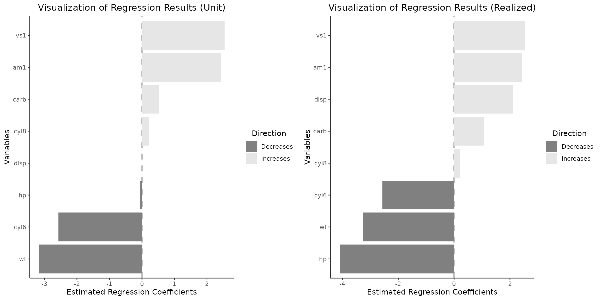

It is imperative to acknowledge that variables such as engine
configuration (specifically, the straight engine `vs1`) and vehicle
`weight` influence fuel efficiency the most, with the effect of `vs`
variable remaining consistent when examining changes in coefficients of
continuous variables occurring within empirical data spanning from the
first (Q1) to the third (Q3) quartiles by default. Nonetheless, a
paradigm shift is observed for several other variables when the analysis
transitions from a per-unit change perspective (as depicted in the left
plot) to an examination of variations between the Q1 and Q3 quartiles
(illustrated in the right plot). Under this new analytical lens,
`displacement` and `horsepower` emerge as the third positive and first
negative most influential factors, respectively. This shift in variable
significance can be attributed to the fact that the differences in
displacement and horsepower among the majority of vehicles do not
typically equate to a mere 1 cubic inch or 1 horsepower. Consequently,
this phenomenon underscores the criticality of considering the
distribution of variables in the interpretation of regression outcomes,
as reliance on per-unit interpretations may lead to misconceptions.

#### 1.3 Visualizing per-unit change together with an intercept

``` r

vis_reg(lm_object, intercept=T)$"PerUnitVis"
```

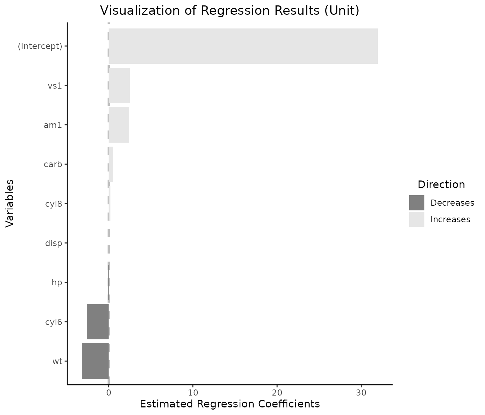

#### 1.4 Adding Confidence Intervals (CIs)

``` r

vis_reg(lm_object, intercept=T, CI=T)$"PerUnitVis"
```

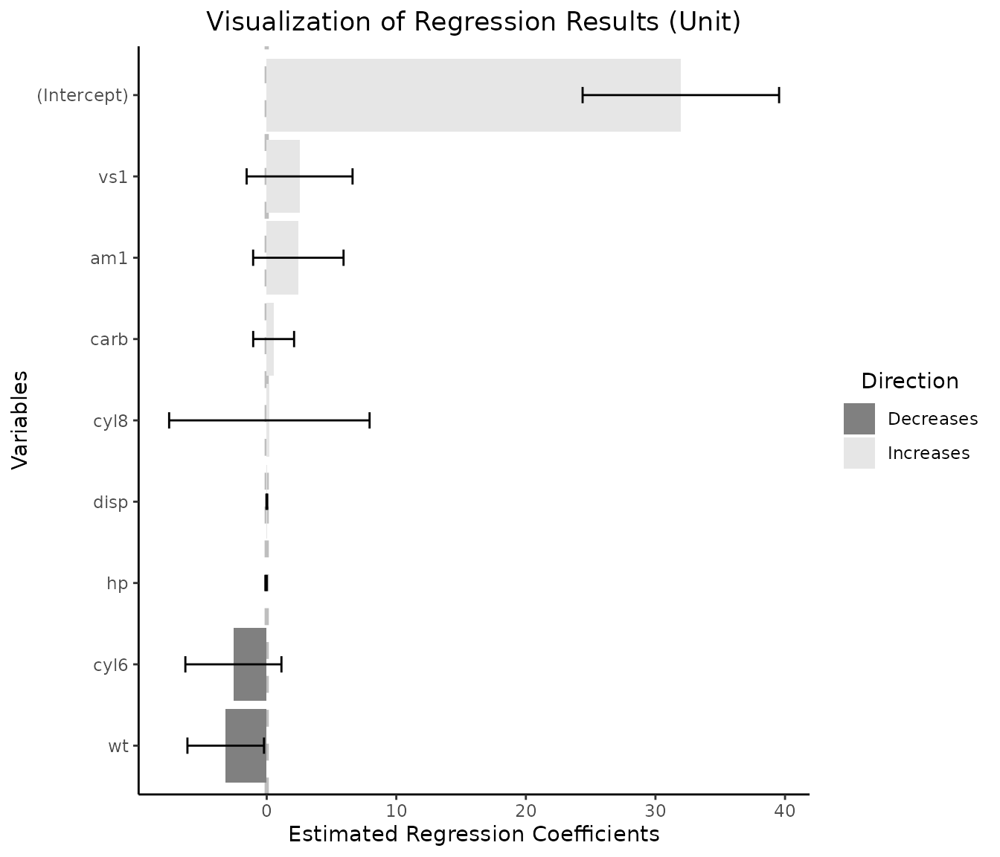

#### 1.4 Customizing pallete, title, and modifying default realized effect size calculations

``` r

grid.arrange(vis_reg(
             lm_object, CI=T,palette=c("palegreen4","tomato1"),
             eff_size_diff=c(1,5),
             title=c(
               "Regression - Unit Change", 
               "Regression - Effective Change (min --> max)"
                     )
                     )$"SidebySide"
             )
```

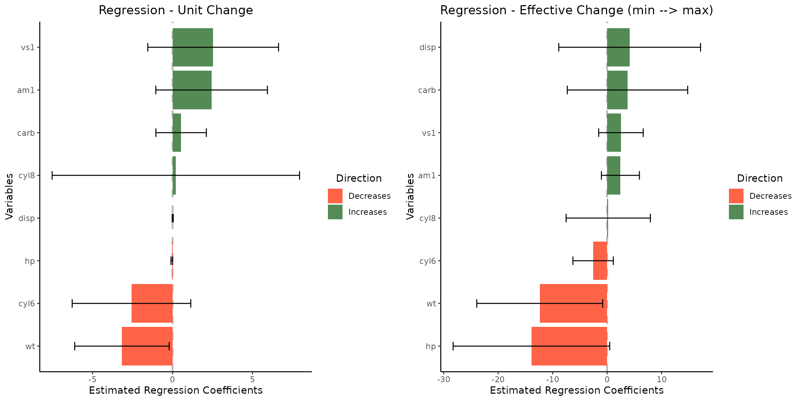

#### 1.5 Customizing individual graphs

``` r

# obtain coefficients for vs and wt
vline1=lm_object$coefficients['vs1'][[1]]
vline2=lm_object$coefficients['wt'][[1]]

vis_reg(lm_object)$"PerUnitVis"+
  geom_hline(yintercept=vline1, linetype="dashed", color = "blue", size=1)+   # add a vertical line
  geom_hline(yintercept=vline2, linetype="dashed", color = "orange", size=1)+
  ggtitle("Visualization of Regression Results (per unit change)")+
  ylim(-5,5)+                                                                 # note the coordinate flip
  xlab("aspects")+
  ylab("coefficients")+
  theme_bw()+
  scale_fill_manual(values = c("black","pink" ))+                             # change mappings 
  theme(plot.title = element_text(hjust = 0.5))                               # place title in the center
#> Scale for fill is already present.
#> Adding another scale for fill, which will replace the existing scale.
```

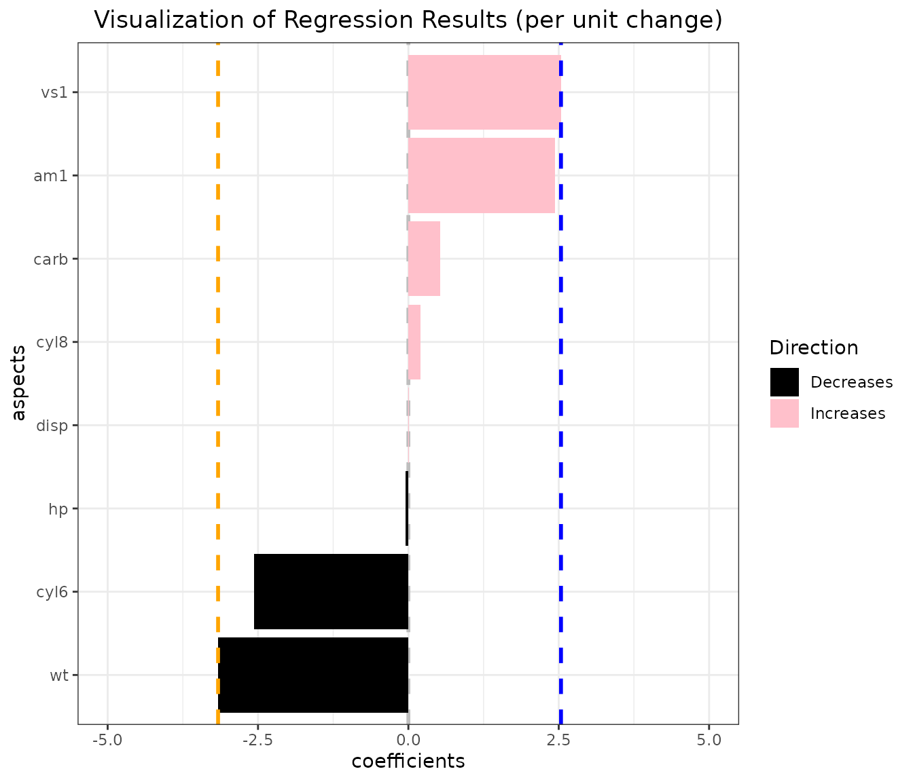

### 2. GLM object

We employ the High School and Beyond dataset (`hsb`) to visualize the
odds of selecting the `Academic` high school program. This analysis is
based on predictors such as sex, race, socioeconomic status and scores
on several subjects.

#### 2.1 Data and fitted object

``` r

# ?hsb

glm_object=glm(
  I(prog == "academic") ~ gender +math+ read + write + science + socst,
  family = binomial(link="logit"), 
  data = faraway::hsb)

summary(glm_object)
#> 
#> Call:
#> glm(formula = I(prog == "academic") ~ gender + math + read + 
#>     write + science + socst, family = binomial(link = "logit"), 
#>     data = faraway::hsb)
#> 
#> Coefficients:
#>             Estimate Std. Error z value Pr(>|z|)    
#> (Intercept) -7.86563    1.33027  -5.913 3.36e-09 ***
#> gendermale   0.25675    0.37566   0.683 0.494314    
#> math         0.10454    0.02996   3.490 0.000484 ***
#> read         0.03869    0.02618   1.478 0.139455    
#> write        0.03794    0.02767   1.371 0.170272    
#> science     -0.08102    0.02676  -3.028 0.002460 ** 
#> socst        0.04908    0.02260   2.172 0.029860 *  
#> ---
#> Signif. codes:  0 '***' 0.001 '**' 0.01 '*' 0.05 '.' 0.1 ' ' 1
#> 
#> (Dispersion parameter for binomial family taken to be 1)
#> 
#>     Null deviance: 276.76  on 199  degrees of freedom
#> Residual deviance: 208.87  on 193  degrees of freedom
#> AIC: 222.87
#> 
#> Number of Fisher Scoring iterations: 4
```

#### 2.2 Default side-by-side plots, CIs and 99% confidence interval

``` r

grid.arrange(vis_reg(
             glm_object,
             CI=T, 
             alpha=0.01
                    )$"SidebySide"
             )
```

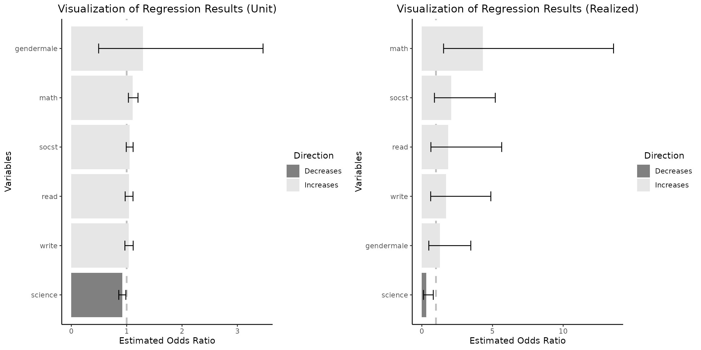

Upon examination of the regression coefficients derived from the
empirical data distribution for a change between Q1 and Q3 for
continuous independent variables, it is evident that the `math` score
variable exerts the highest impact on the odds of selecting an academic
program as shown on the right plot. Concurrently, the variable
`gendermale` which predominates in influence as depicted in the left
plot, transitions to the position of minimal positive impact within this
context.

### 3 GLMNET model objects

#### 3.1. Data

We utilize the LASSO regression to understand how various car
characteristics influence sales price using a data set from 93 Cars on
Sale in the USA in 1993.

``` r

df_glmnet=data.frame(Cars93)

df_glmnet[sample(dim(df_glmnet)[1], 5), ] # examine 5 randomly selected rows
#>    Manufacturer      Model    Type Min.Price Price Max.Price MPG.city
#> 45      Hyundai    Elantra   Small       9.0  10.0      11.0       22
#> 23        Dodge       Colt   Small       7.9   9.2      10.6       29
#> 76      Pontiac Grand_Prix Midsize      15.4  18.5      21.6       19
#> 63   Mitsubishi   Diamante Midsize      22.4  26.1      29.9       18
#> 47      Hyundai     Sonata Midsize      12.4  13.9      15.3       20
#>    MPG.highway     AirBags DriveTrain Cylinders EngineSize Horsepower  RPM
#> 45          29        None      Front         4        1.8        124 6000
#> 23          33        None      Front         4        1.5         92 6000
#> 76          27        None      Front         6        3.4        200 5000
#> 63          24 Driver only      Front         6        3.0        202 6000
#> 47          27        None      Front         4        2.0        128 6000
#>    Rev.per.mile Man.trans.avail Fuel.tank.capacity Passengers Length Wheelbase
#> 45         2745             Yes               13.7          5    172        98
#> 23         3285             Yes               13.2          5    174        98
#> 76         1890             Yes               16.5          5    195       108
#> 63         2210              No               19.0          5    190       107
#> 47         2335             Yes               17.2          5    184       104
#>    Width Turn.circle Rear.seat.room Luggage.room Weight  Origin
#> 45    66          36           28.0           12   2620 non-USA
#> 23    66          32           26.5           11   2270     USA
#> 76    72          41           28.5           16   3450     USA
#> 63    70          43           27.5           14   3730 non-USA
#> 47    69          41           31.0           14   2885 non-USA
#>                   Make
#> 45     Hyundai Elantra
#> 23          Dodge Colt
#> 76  Pontiac Grand_Prix
#> 63 Mitsubishi Diamante
#> 47      Hyundai Sonata

levels(df_glmnet$Origin)                                                        # check level attributes
#> [1] "USA"     "non-USA"

df_glmnet=df_glmnet %>% mutate(MPG.avg = (MPG.city + MPG.highway) / 2)          # calculate average MPG
```

#### 3.2 LASSO - data preparation and model

``` r

y_lasso=df_glmnet$Price

x_lasso=model.matrix(
        as.formula(paste("~",
                         paste(c("MPG.avg","Horsepower","RPM","Wheelbase", 
                                 "Passengers","Length", "Width", "Weight",
                                 "Origin","Man.trans.avail"
                                 ), collapse = "+"
                               ),sep = ""
                         )
                   ), data=df_glmnet
                     )
                                                   

x_lasso = x_lasso[, -1]                                                         # remove intercept

ndim_lasso=dim(x_lasso)[1]

cv_model_lasso = cv.glmnet(x_lasso, y_lasso, family="gaussian", alpha=1)        # LASSO regression

# extract value of lambda that gives minimum mean cross-validated error
best_lambda_lasso = cv_model_lasso$lambda.min                                   

plot(cv_model_lasso)
```

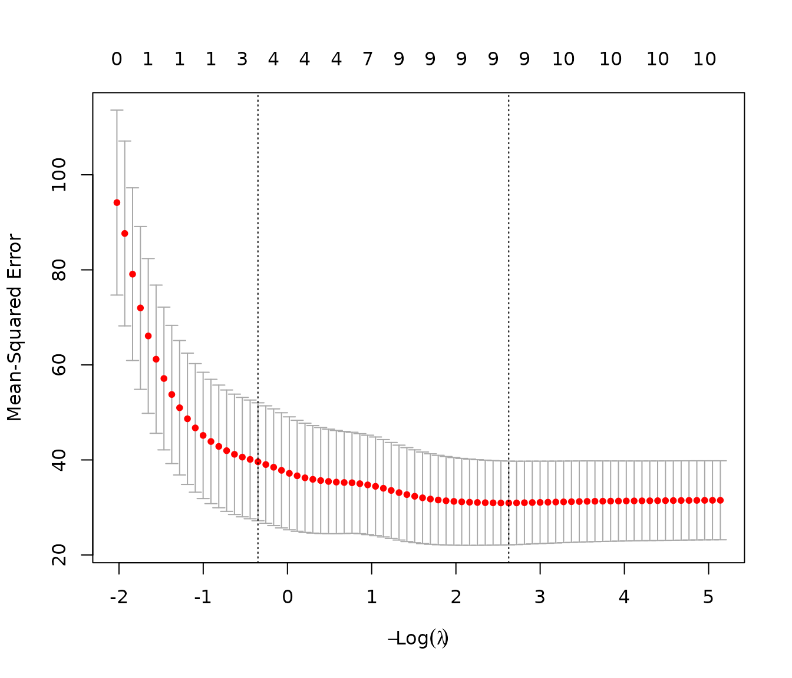

``` r

best_model_lasso = glmnet(x_lasso, y_lasso, family="gaussian", alpha=1, 
                            lambda=best_lambda_lasso)

coefficients(best_model_lasso)
#> 11 x 1 sparse Matrix of class "dgCMatrix"
#>                             s0
#> (Intercept)        41.95022623
#> MPG.avg            -0.22248811
#> Horsepower          0.14052097
#> RPM                -0.00231447
#> Wheelbase           0.49693874
#> Passengers         -1.24284515
#> Length              0.07883149
#> Width              -1.22607113
#> Weight              .         
#> Originnon-USA       3.50458209
#> Man.trans.availYes -1.70340278
```

Note that on Lasso regression plots two values of regularization
parameter $\lambda$ are indicated: $\lambda_{min}$ and $\lambda_{1se}$.
What is the difference? The first, $\lambda_{min}$is the value that
minimizes the cross-validated error, leading to a model that fits the
data with the lowest prediction error, but with a potential risk of
overfitting. Conversely,$\lambda_{1se}$. is a more conservative choice,
representing the largest $\lambda$ within one standard error of the
minimum error, resulting in a simpler, more robust model that is less
likely to overfit while maintaining a prediction error close to the
minimum. For our analysis we select $\lambda_{min}$.

The LASSO regression has reduced the coefficient for the `weight`
variable to zero, likely due to its high correlation with other
variables included in the analysis.

#### 3.3 Checking correlations for numeric variables of interest

``` r

df_glmnet_num=df_glmnet%>%select_if(function(x) is.numeric(x))                  

cols_to_select = c("MPG.avg","Horsepower","RPM","Wheelbase","Passengers",
                   "Length", "Width", "Weight")

df_glmnet_num=df_glmnet_num %>%select(all_of(cols_to_select))                 

corPlot(df_glmnet_num,xlas=2)
```

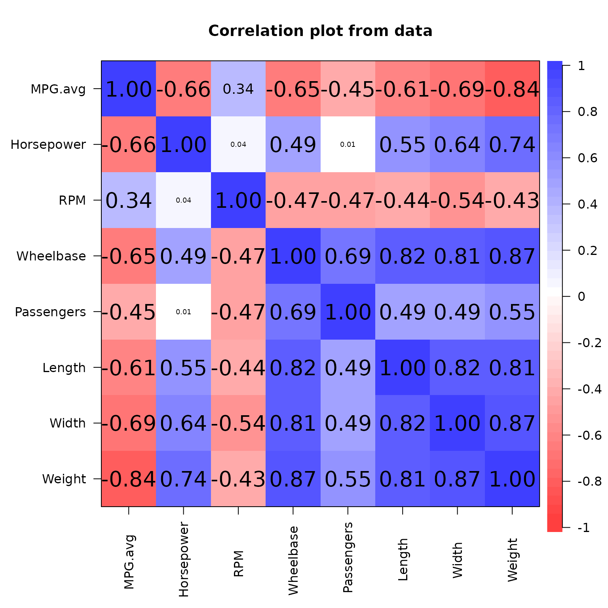

The correlation matrix substantiates our hypothesis, revealing a high
correlation between weight and multiple variables incorporated in the
model.

#### 3.4 Default LASSO plots with custom realized effect size

``` r

grid.arrange(vis_reg(best_model_lasso,eff_size_diff=c(1,3),         # Q2 - minimum
                     glmnet_fct_var="Originnon-USA")$"SidebySide")  # note the naming pattern for categorical variables
```

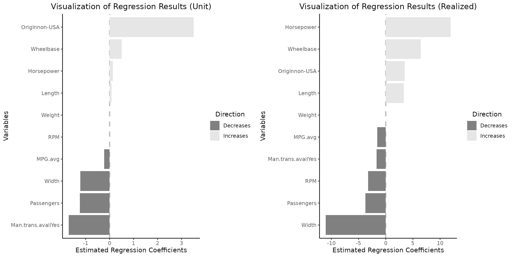

Note that the `Weight` variable is retained and remains consistently
equal to $0$ across both plots. Additionally, the variation in
regression coefficients and their interpretation align with the paradigm
change discussed previously.

#### 3.5 Modifying idividial plots and arraning them back together

``` r

plt_1=vis_reg(best_model_lasso,eff_size_diff=c(1,3),
              glmnet_fct_var="Originnon-USA")$"PerUnitVis"+
              ggtitle("Visualization of CV.GLMNET Results (per unit change)")+
              ylim(-4,4)+
              xlab("Car characteristics")+
              ylab("LASSO coefficients")+
              theme_bw()+
              scale_fill_manual(values = c("red","whitesmoke" ))+                            
              theme(plot.title = element_text(hjust = 0.5))   
#> Scale for fill is already present.
#> Adding another scale for fill, which will replace the existing scale.

plt_2=vis_reg(best_model_lasso, eff_size_diff=c(1,3), 
              glmnet_fct_var="Originnon-USA")$"RealizedEffectVis"+
              ggtitle("Visualization of CV.GLMNET Results (effective:min --> Q2)")+
              ylim(-15,15)+        
              xlab("Car characteristics")+
              ylab("LASSO coefficients")+
              theme_bw()+
              scale_fill_manual(values = c("maroon1","palegreen1" ))+                            
              theme(plot.title = element_text(hjust = 0.5))   
#> Scale for fill is already present.
#> Adding another scale for fill, which will replace the existing scale.

plt_3=arrangeGrob(plt_1,plt_2, nrow=1, widths = c(1,1))

grid.arrange(plt_3)
```

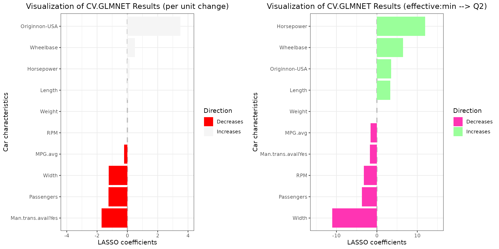

Note that coefficients with absolute values exceeding those specified in
the `ylim` vector will not be visualized. For instance, setting
`ylim`=c(-2,2) for the left plot would result in the omission of the
`Originnon-USA` coefficient from the visualization.

#### 3.6 Post Selection Inference

#### 3.6.1 Data

We employ the Stanford Heart Transplant data (`jasa`) which bcontains
detailed records of heart transplant patients, including their survival
times, status, and other clinical variables, used for survival analysis
to demonstrate the construction of CIs for `glmnet` type objects.

``` r

# ?jasa

heart_df=as.data.frame(survival::jasa)

heart_df_filtered = heart_df %>%filter(!rowSums(is.na(.)))                      # remove rows containing NaN values

# check last 6 rows of the data frame
tail(heart_df_filtered)
#>       birth.dt  accept.dt    tx.date    fu.date fustat surgery      age futime
#> 93  1925-10-10 1973-07-11 1973-08-07 1974-04-01      0       0 47.75086    264
#> 94  1929-11-11 1973-09-14 1973-09-17 1974-02-25      1       1 43.84120    164
#> 96  1947-02-09 1973-10-04 1973-10-16 1974-04-01      0       0 26.65024    179
#> 97  1950-04-11 1973-11-22 1973-12-12 1974-04-01      0       0 23.61670    130
#> 98  1945-04-28 1973-12-14 1974-03-19 1974-04-01      0       0 28.62971    108
#> 100 1939-01-31 1974-02-22 1974-03-31 1974-04-01      0       1 35.06092     38
#>     wait.time transplant mismatch hla.a2 mscore reject
#> 93         27          1        2      0   0.33      0
#> 94          3          1        3      0   1.20      1
#> 96         12          1        2      0   0.46      0
#> 97         20          1        3      1   1.78      0
#> 98         95          1        4      1   0.77      0
#> 100        37          1        3      0   0.67      0
```

#### 3.6.2 Data observations

``` r

# filtered data only contains patients who received a transplant,
sum(heart_df_filtered$transplant!=1)
#> [1] 0

# mismatch scores are weakly correlated,
print('Correlation between mismatch scores:')
#> [1] "Correlation between mismatch scores:"
cor(heart_df_filtered$mscore,heart_df_filtered$mismatch)
#> [1] 0.3881104

# if rejection occurs, the death is certain, at least, in this data set
heart_cont_table=table(heart_df_filtered$reject,heart_df_filtered$fustat)
dimnames(heart_cont_table) =list(
  Reject = c("No", "Yes"), 
  Status = c("Alive", "Deceased")
  )
heart_cont_table
#>       Status
#> Reject Alive Deceased
#>    No     24       12
#>    Yes     0       29
                       
# 'age' is skewed variable with a very big range
paste("Range of '\ age \' variable is : ",diff(range(heart_df_filtered$age)))
#> [1] "Range of ' age ' variable is :  44.8569472963724"

par(mfrow=c(2,2))
hist(heart_df_filtered$age, main="Histogram of Age", xlab="age")
boxplot(heart_df_filtered$age,main="Boxplot of Age", ylab="age")
hist(sqrt(heart_df_filtered$age),main="Histogram of transformed data", xlab="Sqrt(age)")
boxplot(sqrt(heart_df_filtered$age),main="Boxplot of transformed data", ylab="Sqrt(age)")
```

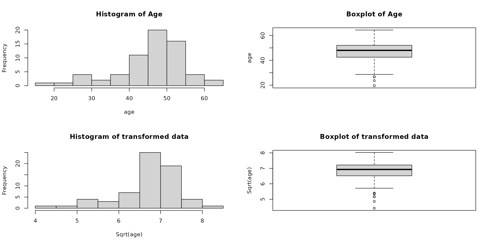

#### 3.6.3 A note about rounding

``` r

# observe that age variable is not rounded

# it is calculated in the following manner
age_calc_example=difftime(heart_df_filtered$accept.dt, 
                          heart_df_filtered$birth.dt,units = "days")/365.25

# check the first calculated value
age_calc_example[1]==heart_df_filtered[1,]$age
#> [1] TRUE

# check randomly selected value
n_samp=sample(dim(heart_df_filtered)[1],1)
age_calc_example[n_samp]==heart_df_filtered[n_samp,]$age
#> [1] TRUE

# check 5 point summary 
heart_df_filtered$age%>%summary()
#>    Min. 1st Qu.  Median    Mean 3rd Qu.    Max. 
#>   19.55   42.50   48.02   46.03   52.08   64.41

# check 5 point summary for data rounded down to the nearest integer
heart_df_filtered$age%>%floor()%>%summary()
#>    Min. 1st Qu.  Median    Mean 3rd Qu.    Max. 
#>   19.00   42.00   48.00   45.54   52.00   64.00
```

In the realm of our visualization tool, two primary inquiries emerge:

\*How does the Odds Ratio (OR) change with a **unit increment** in the
variables under scrutiny?

\*How does the OR vary in response to alterations *exceeding a single
unit*, such as the disparity between the first (Q1) and third (Q3)
quartiles within the data distribution?

It is crucial to acknowledge that the data distribution may not always
support a per-unit interpretation, as exemplified by the `age` variable
within our dataset. Consequently, when engaging in calculations that
encompass changes across quartiles, it is advisable to employ rounding
strategies (either floor or ceiling functions) prior to data input. This
approach facilitates the comparison of ORs associated with unit age
discrepancies (e.g., 1 year) against those pertaining to more
substantial differences (e.g., 10 years).

Absence of rounding can lead to nuanced interpretations. Consider, for
instance, the interquartile range for the `age` variable, which is
calculated as Q3 - Q1 (52.08 - 42.50 = 9.58 years). In such scenarios,
the OR derived from the Q3 to Q1 variation in `age` essentially compares
the odds of mortality among individuals with an age gap of 9.58 years, a
differential that may not intuitively serve as the most illustrative
measure. In the
[`vis_reg()`](https://vadimtyuryaev.github.io/RegrCoeffsExplorer/reference/vis_reg.md)
function, the `round_func` parameter allows for the specification of
rounding the calculated differences either upwards or downwards to the
nearest integer, thus providing a more instinctual explication.

#### 3.6.4 Model

``` r

# reject categorical variable in not included due to the reason previously stated
heart_df_filtered = heart_df_filtered %>%
  mutate(across(all_of(c("surgery")), as.factor))

# apply 'sqrt()' transformation to 'age' variable
heart_df_filtered$sqrt.age=sqrt(heart_df_filtered$age)

y_heart=heart_df_filtered$fustat

x_heart=model.matrix(as.formula(paste("~",
         paste(c("sqrt.age" ,"mismatch","mscore", "surgery"),collapse = "+"),
         sep = "")), data=heart_df_filtered)

x_heart=x_heart[, -1]
x_heart_orig=x_heart                                                            # save original data set
x_heart=scale(x_heart,T,T)                                                    

gfit_heart = cv.glmnet(x_heart,y_heart,standardize=F,family="binomial")

lambda_heart=gfit_heart$lambda.min
n_heart=dim(x_heart)[1]

beta_hat_heart=coef(gfit_heart, x=x_heart, y=y_heart, s=lambda_heart, exact=T)

# note that lambda should be multiplied by the number of rows
out_heart = fixedLassoInf(x_heart,y_heart,beta_hat_heart,lambda_heart*n_heart,
                          family="binomial")
#check the output
out_heart
#> 
#> Call:
#> fixedLassoInf(x = x_heart, y = y_heart, beta = beta_hat_heart, 
#>     lambda = lambda_heart * n_heart, family = "binomial")
#> 
#> Testing results at lambda = 1.336, with alpha = 0.100
#> 
#>  Var   Coef Z-score P-value LowConfPt UpConfPt LowTailArea UpTailArea
#>    1  0.811   2.738   0.009     0.269    1.302       0.048      0.049
#>    2 -0.514  -1.681   0.172    -1.008    0.415       0.050      0.049
#>    3  0.497   1.487   0.232    -0.624    1.033       0.049      0.049
#>    4 -0.430  -1.605   0.149    -0.867    0.276       0.050      0.050
#> 
#> Note: coefficients shown are full regression coefficients

# note the class
class(out_heart)
#> [1] "fixedLogitLassoInf"
```

Although the data input is centered and scaled, the coefficients and CIs
are presented on the original scale. The package includes a function
named `detransform` that carries out the re-scaling and de-centering
process for effective size difference calculations. Alternatively,
consider rounding down or up before passing the data to the function.

#### 3.6.5 A note on data scaling and centering in relation to `glmnet` objects

``` r
 
# back transformation logic
 x_heart_reconstructed = t(apply(x_heart, 1, function(x) 
   x*attr(x_heart,'scaled:scale') + attr(x_heart, 'scaled:center')))

 # check
 all.equal(x_heart_orig,x_heart_reconstructed)
#> [1] TRUE
 
 # same via a function
 x_heart_reconstructed.2=detransform(x_heart)
 all.equal(x_heart_orig,x_heart_reconstructed.2)
#> [1] TRUE
```

#### 3.6.6 LASSO regression with CIs and custom realized effect size

``` r

grid.arrange(vis_reg(out_heart, CI=T, glmnet_fct_var=c("surgery1"), 
                     round_func="none",eff_size_diff=c(1,3))$"SidebySide"
             )
```

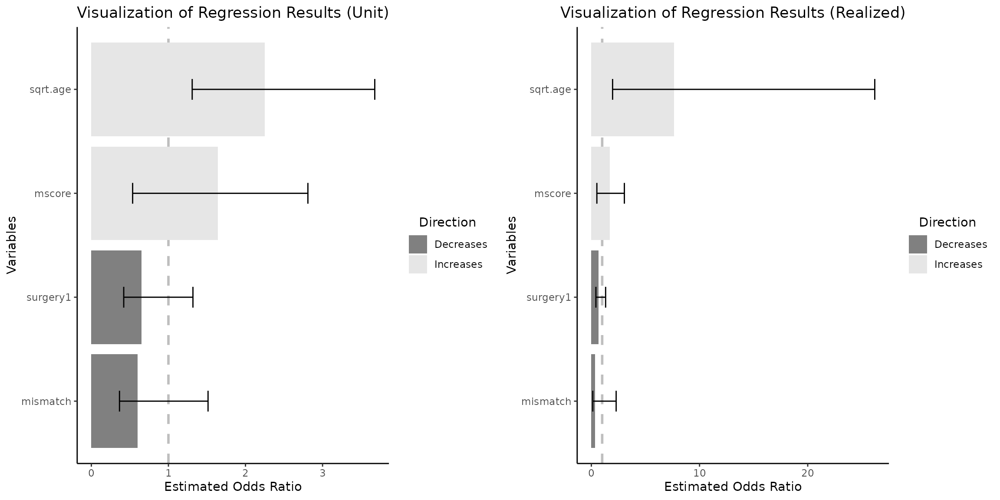

#### 3.6.7 A note on Selective Inference

In the domain of Selective Inference, it is noteworthy that CIs may not
encompass the estimated coefficients. To elucidate, scenarios may arise
wherein both bounds of the confidence intervals are positioned beneath
the estimated coefficients. The following example is reproduced without
any changes from **“Tools for Post-Selection Inference”** (pp.9-10).

``` r

set.seed(43)
n = 50
p = 10
sigma = 1
x = matrix(rnorm(n*p),n,p)
x=scale(x,TRUE,TRUE)
beta = c(3,2,rep(0,p-2))
y = x%*%beta + sigma*rnorm(n)
pf=c(rep(1,7),rep(.1,3)) #define penalty factors
pf=p*pf/sum(pf) # penalty factors should be rescaled so they sum to p
xs=scale(x,FALSE,pf) #scale cols of x by penalty factors
# first run glmnet
gfit = glmnet(xs, y, standardize=FALSE)
# extract coef for a given lambda; note the 1/n factor!
# (and we don't save the intercept term)
lambda = .8
beta_hat = coef(gfit, x=xs, y=y, s=lambda/n, exact=TRUE)[-1]
# compute fixed lambda p-values and selection intervals
out = fixedLassoInf(xs,y,beta_hat,lambda,sigma=sigma)
#rescale conf points to undo the penalty factor
out$ci=t(scale(t(out$ci),FALSE,pf[out$vars]))
out
#> 
#> Call:
#> fixedLassoInf(x = xs, y = y, beta = beta_hat, lambda = lambda, 
#>     sigma = sigma)
#> 
#> Standard deviation of noise (specified or estimated) sigma = 1.000
#> 
#> Testing results at lambda = 0.800, with alpha = 0.100
#> 
#>  Var   Coef Z-score P-value LowConfPt UpConfPt LowTailArea UpTailArea
#>    1  3.987  18.880   0.000     2.657    3.229       0.049      0.050
#>    2  2.911  13.765   0.000     1.454    2.364       0.050      0.049
#>    3  0.187   0.776   0.303    -0.747    1.671       0.050      0.050
#>    4  0.149   0.695   0.625    -1.040    0.353       0.050      0.049
#>    5 -0.294  -1.221   0.743    -0.379    2.681       0.050      0.050
#>    6 -0.206  -0.978   0.685    -0.349    1.568       0.049      0.050
#>    7  0.195   0.914   0.407    -0.487    0.401       0.049      0.049
#>    8  0.006   0.295   0.758    -1.711    0.363       0.050      0.049
#>    9 -0.015  -0.723   0.458    -0.368    0.531       0.050      0.050
#>   10 -0.003  -0.157   0.948    -0.011    7.828       0.050      0.050
#> 
#> Note: coefficients shown are partial regression coefficients
```

Note that confidence intervals for the first two variables contain the
**true** values `c(3,2)` and **do not encompass** the estimated
coefficients `c(3.987,2.911)`.

#### 3.6.7 GLMNET with penalty factor and CIs

``` r

pf_heart=c(0.3, 0.1,0.1,0.1)
p_l=length(pf_heart)
pf_heart=p_l*pf_heart/sum(pf_heart)

xs_heart_res=scale(x_heart,FALSE,pf_heart)                                      # note that the data is being scaled again

gfit_heart_pef_fac_res = cv.glmnet(xs_heart_res, y_heart, standardize=FALSE, 
                                   family="binomial")

lambda_heart_pef_fac_res=gfit_heart_pef_fac_res$lambda.min

beta_hat_heart_res=coef(gfit_heart_pef_fac_res, x=xs_heart_res, y=y_heart,
                        s=lambda_heart_pef_fac_res, exact=F)

out_heart_res = fixedLassoInf(xs_heart_res,y_heart,beta_hat_heart_res,
                              lambda_heart_pef_fac_res*n_heart,family="binomial")

out_heart_res$ci=t(scale(t(out_heart_res$ci),FALSE,pf_heart[out_heart_res$vars]))

out_heart_res
#> 
#> Call:
#> fixedLassoInf(x = xs_heart_res, y = y_heart, beta = beta_hat_heart_res, 
#>     lambda = lambda_heart_pef_fac_res * n_heart, family = "binomial")
#> 
#> Testing results at lambda = 0.877, with alpha = 0.100
#> 
#>  Var   Coef Z-score P-value LowConfPt UpConfPt LowTailArea UpTailArea
#>    1  1.630   2.774   0.009     0.273    1.304       0.050      0.048
#>    2 -0.351  -1.690   0.121    -1.038    0.244       0.049      0.049
#>    3  0.342   1.491   0.167    -0.397    1.078       0.049      0.049
#>    4 -0.291  -1.608   0.127    -0.884    0.219       0.049      0.050
#> 
#> Note: coefficients shown are full regression coefficients
```

#### 3.6.8 A second note on data scaling and centering in relation to `fixedLassoInf` objects

``` r

x_heart_test_3=detransform(xs_heart_res, attr_center=NULL)

x_heart_test_3=detransform(x_heart_test_3,
                           attr_scale=attr(x_heart, 'scaled:scale'),
                           attr_center=attr(x_heart, 'scaled:center')
                           )
# check
all.equal(x_heart_test_3,x_heart_orig)
#> [1] TRUE
```

The **vis_reg()** function operates by extracting the necessary
information from the provided object. However, in the context of
generating CIS with penalty factors for `fixedLassoInf` type objects, a
dual transformation, as illustrated previously, is necessary. Direct
reconstruction from the passed object is not possible in such instances.
Therefore, to obtain CIs for `fixedLassoInf` objects that have been
fitted using penalty factors, it is essential to supply the original,
non-transformed data.

#### 3.6.9 Post selection inference with CIs and penalty factors

``` r

# note that case_penalty=T and x_data_orig must be specified

# effective change between Q1(2) and max(5)
grid.arrange(vis_reg(out_heart_res, CI=T, glmnet_fct_var=c("surgery1"), 
                     case_penalty=T, x_data_orig=x_heart_orig,
                     eff_size_diff=c(2,5))$"SidebySide")
```

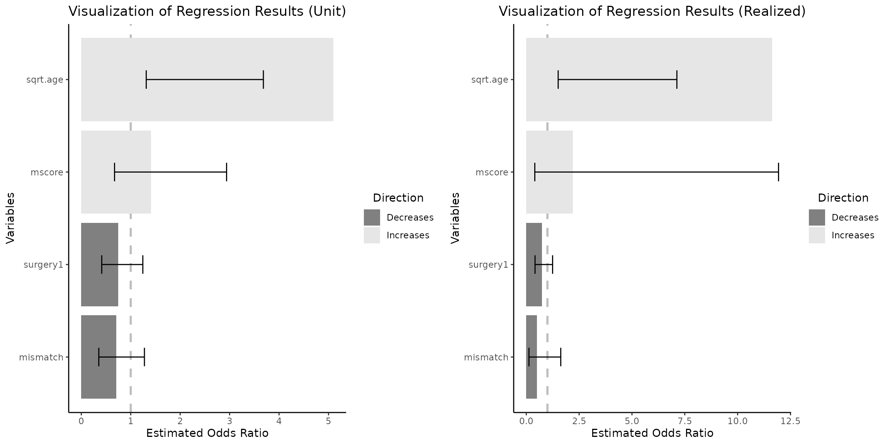

It is important to observe that when the computed effective size
difference is below 1, such would have been the case if we utilized
default Q3 - Q1 difference which is 7.217 - 6.519 = 0.698 ( see
`summary(heart_df_filtered$sqrt.age)` ), the OR on the right plot would
correspond to a change of **less** than one unit. As a result, the
numerical values presented on the right plot would be lower than those
on the left plot. This outcome may appear counter intuitive at first
glance.
